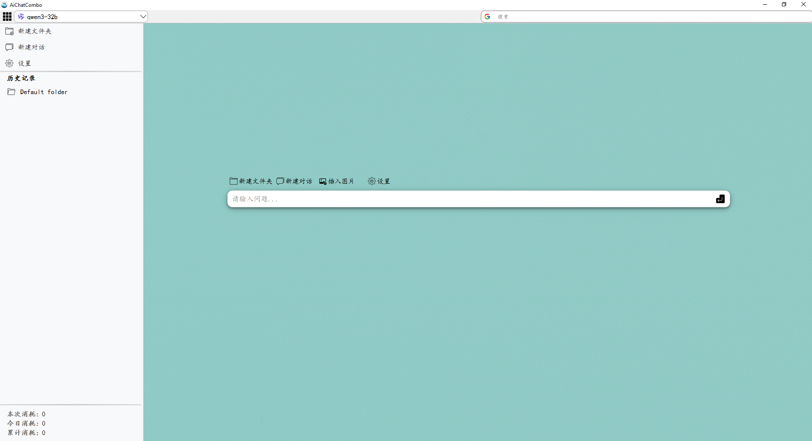
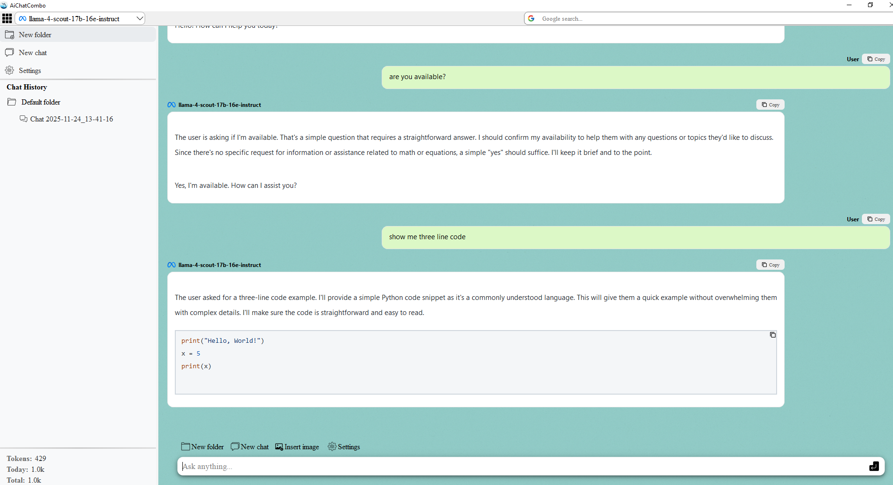
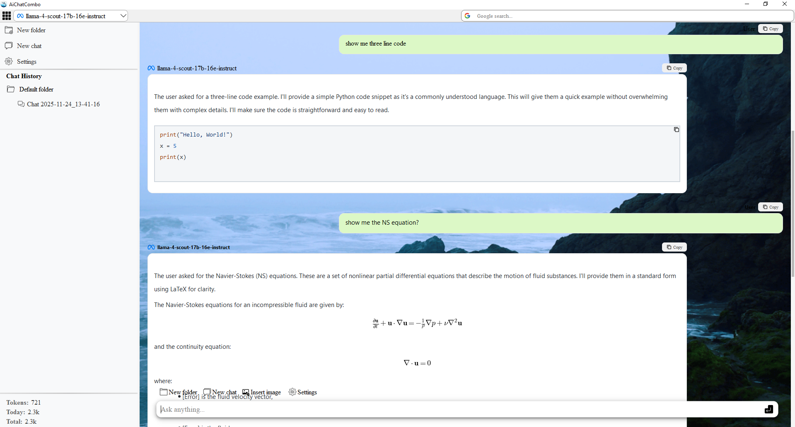

# Chat & Operation Controller Application

A **Python-based desktop application** for advanced chat management, AI integration, and operation control, built with **PySide6**.
Supports multilingual UI, theme customization, AI provider configuration, dynamic chat backgrounds, and adaptive user settings.

---

## Features ✨

* Multi-language support (English / Chinese)
* Theme selection: Light / Dark / Blue
* Chat window with configurable AI providers
* Toolbar with search engine integration (Baidu, Google)
* Customizable font settings across UI components
* Dynamic chat background images
* User account configuration via `usr/account.json` or Settings page
* AI model configuration including API Key, Base URL, and System Prompt
* Modular design: operation controller separated from main window
* Local chat history saved and auto-loaded

---

## Installation 💻

```bash
git clone https://github.com/mini-walker/ChatOpsDesktop.git
cd ChatOpsDesktop
pip install -r requirements.txt
python src/main.py
```

### EXE generation for Windows 🖥️

**Single exe file**

```bat
.\Generate_single_exe.bat
```

**Package of exe files**

```bat
.\Generate_exe_package.bat
```

---

## Usage 🚀

1. Configure user account info in **Settings** or by editing `usr/account.json`.
2. Launch the application.
3. Use **Settings** to configure:

   * Appearance (theme, font, chat background)
   * Language
   * Toolbar search engine
   * AI provider and API key
4. Interact with AI through the chat window.
5. Toolbar allows quick searches with selected search engines.
6. All changes are saved automatically.

---

## Account Examples 📝

`usr/account.json` stores user info and app preferences.

**General format:**

```json
{
  "Provider": "The LLM provider",
  "base_url": "the base url",
  "API-Key": "your API-key",
  "models": [
   "the available models"
  ]
}
```

**OpenRouter example:**

```json
{
  "Provider": "OpenRouter",
  "base_url": "https://openrouter.ai/api/v1/chat/completions",
  "API-Key": "your API-key",
  "models": [
    "x-ai/grok-4.1-fast",
    "openai/gpt-4o-mini",
    "tngtech/deepseek-r1t2-chimera:free",
    "deepseek/deepseek-r1-0528-qwen3-8b:free",
    "qwen/qwen2.5-vl-32b-instruct:free",
    "google/gemini-2.0-flash-exp:free",
    "openai/gpt-4o",
    "meta-llama/llama-3.3-70b-instruct:free",
    "kwaipilot/kat-coder-pro:free"
  ]
}
```

**Groq example:**

```json
{
  "Provider": "Groq",
  "base_url": "https://api.groq.com/openai/v1/chat/completions",
  "API-Key": "your API-key",
  "models": [
    "qwen/qwen3-32b",
    "openai/gpt-oss-120b",
    "openai/gpt-oss-20b",
    "openai/gpt-oss-safeguard-20b",
    "meta-llama/llama-4-scout-17b-16e-instruct",
    "meta-llama/llama-guard-4-12b"
  ]
}
```

**Arli example:**

```json
{
  "Provider": "Arli",
  "base_url": "https://api.arliai.com/v1/chat/completions",
  "API-Key": "your API-key",
  "models": [
    "Qwen3-235B-A22B-Instruct-2507",
    "Gemma-3-27B-ArliAI-RPMax-v3",
    "Llama-3.3-70B-ArliAI-RPMax-v3"
  ]
}
```

---

## Dynamic Chat Background 🎨

Users can set chat background dynamically via:

* `Settings > Appearance > Chat Background`
* Or by editing `"chat_background"` field in `account.json`

The chat window will refresh to display the selected image.

---

## Screenshots 📸



*Figure 1: User interface with background.*


*Figure 2: Chat window with dynamic background.*




*Figure 3: Chat window with dynamic background.*



*Figure 4: Example of AI replies with code and equations.*


---

## Dependencies 📦

* Python >= 3.10
* PySide6
* pandas

---

## License ⚖️

MIT License

---

## Author ✍️

**Shanqin Jin**
Email: [sjin@mun.ca](mailto:sjin@mun.ca)
